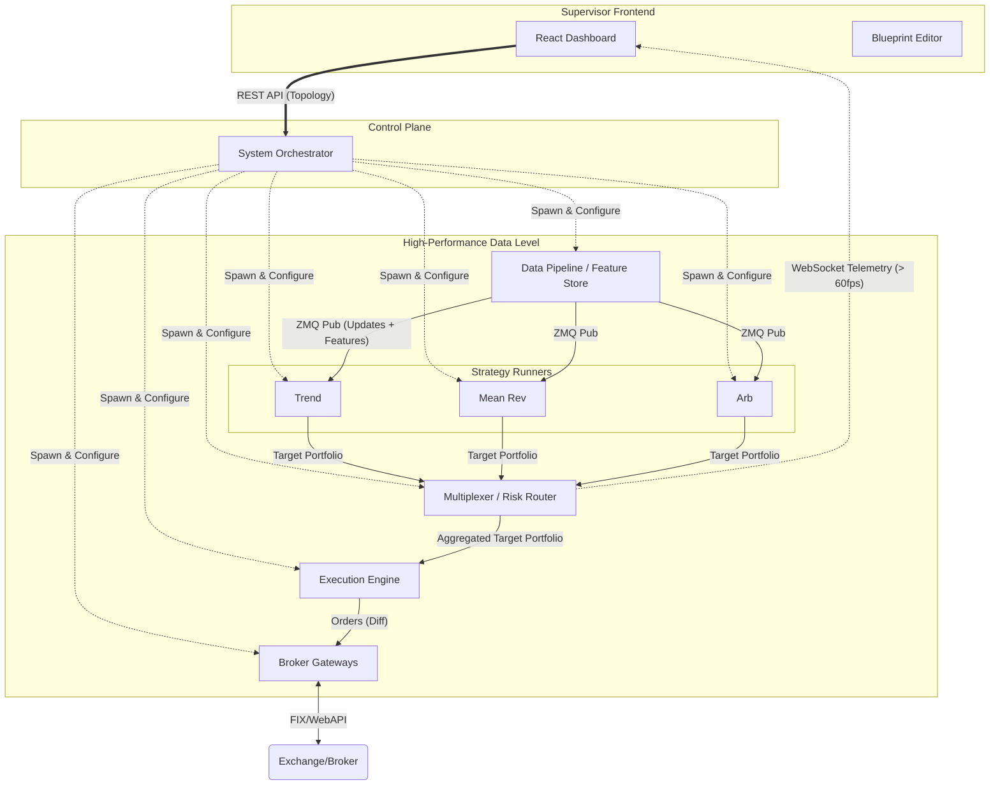
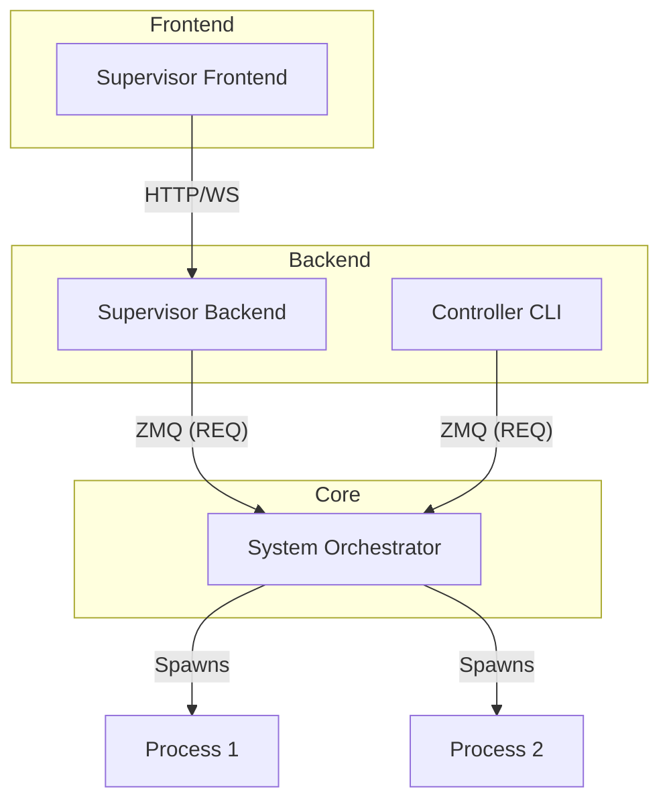

# Helios Trading Platform 🚀

**A High-Performance, Visual Algorithmic Trading Ecosystem**

Helios is a distributed, full-stack trading platform designed to bridge the gap between **high-frequency performance** and **visual usability**. It combines a low-latency **Rust** backend with a modern **React-based** supervision interface, allowing you to design, monitor, and hot-swap strategies visually.

> 📸 **Visual Control Board**
>
> *(Screenshot Placeholder: The ReactFlow Blueprint Editor showing nodes connected by animated data spines)*

## 🏗 System Architecture

The ecosystem relies on a central **Orchestrator** to manage a dynamic graph of microservices. Components communicate via **ZeroMQ (ZMQ)** for sub-millisecond latency.

Crucially, Helios uses a **Target Portfolio** architecture: Strategies emit their "ideal state", the Multiplexer aggregates them into a global target (applying risk limits), and the Execution Engine simply attempts to reach that target (diffing current vs. target).



## 🌟 Key Components

### 1. System Orchestrator Ecosystem 🧠
The administrative core is now modularized into three components for better scalability and developer experience:



- **System Orchestrator (Daemon)**: The core service (`system-orchestrator`) that manages process lifecycles and listens for ZMQ commands.
- **Controller (CLI)**: A developer tool (`controller`) for fast iteration, deploying layouts, and debugging the daemon.
- **Supervisor Backend**: An API Gateway (`supervisor-backend`) that connects the React Frontend to the Daemon, handling layout persistence and command forwarding.

### 2. Trading Core (`trading-core`) 🧱
The shared **Rust** foundation used by all backend services.
- **Purpose**: Ensures consistent data types and communication patterns across the ecosystem.
- **Features**: Semantic ZMQ wrappers, shared domain models (`Instrument`, `Portfolio`), and standardized file system access.

### 3. Strategy Lab (`strategy-lab`) 🧪
High-performance strategy execution environment written in **C++**.
- **Role**: Hosts the actual trading logic (e.g., Trend Following, Mean Reversion).
- **Communication**: Consumes market data/features and emits a "Target Portfolio" (ideal state) to the Multiplexer.

### 4. Multiplexer (`multiplexer`) 🔀
The "Signal Aggregator" written in **Rust**.
- **Role**: Aggregates target portfolios from multiple strategies into a single "Net Target Portfolio".
- **Conflict Resolution**: Merges conflicting signals (e.g., Strat A buys, Strat B sells) based on weights/priorities.

### 5. Execution Engine (`execution-engine`) ⚙️
The Safe State Reconciler written in **Rust**.
- **Role**: Receives the Aggregated Target Portfolio.
- **Risk Management**: Enforces hard constraints (Max Leverage, Drawdown, Order Size) *before* generating orders.
- **Logic**: Calculates diff (Target vs Actual) -> Checks Risk -> Sends Orders.

### 6. Data Pipeline (`data-pipeline`) 🐍
The **Python**-based market data engine.
- **Role**: Ingests raw data (Polygon, CSVs), calculates derived features (e.g., Z-Scores), and publishes vectorized batches to strategies.

### 7. Gateways 🔌
- **broker-gateway**: Generic Rust adapter interface for defining exchange standards.
- **gateway-paper**: Standalone Rust service for simulation and paper trading.

### 8. Supervisor Frontend (`supervisor-frontend`) 💻
- **Tech Stack**: TypeScript, React, ReactFlow.
- **Role**: Provides the visual "Control Plane" to design topologies and monitor system health.

## 🗺 Vision & Roadmap

### Phase 1: Foundation & Data 🚧
- [x] Core Rust Microservices & ZMQ Layer
- [x] React Frontend Skeleton
- [ ] **Feature Store**: Calculate rolling stats (Z-scores) in Python/Rust and stream alongside price.

### Phase 2: Risk & Execution
- [ ] **Policy Engine**: Hard constraints (e.g., "Liquidate if Daily DD > 2%") enforced at the Execution Engine level.
- [ ] **Gateways**: Deploy independent processes for IBKR and Paper trading.

### Phase 3: The "Visual" Revolution
- [ ] **Dynamic API**: `curl` commands to re-wire the graph at runtime.
- [ ] **Visual-to-Native**: (Future) Transpile visual graph logic directly into optimized C++ binaries.

## 🛠 Running the Platform

```bash
# Start the Backend Services (via Orchestrator effectively)
make services-up

# Start the Supervisor UI
cd supervisor-frontend && npm run dev
```

---
*Built for speed, designed for control.*
